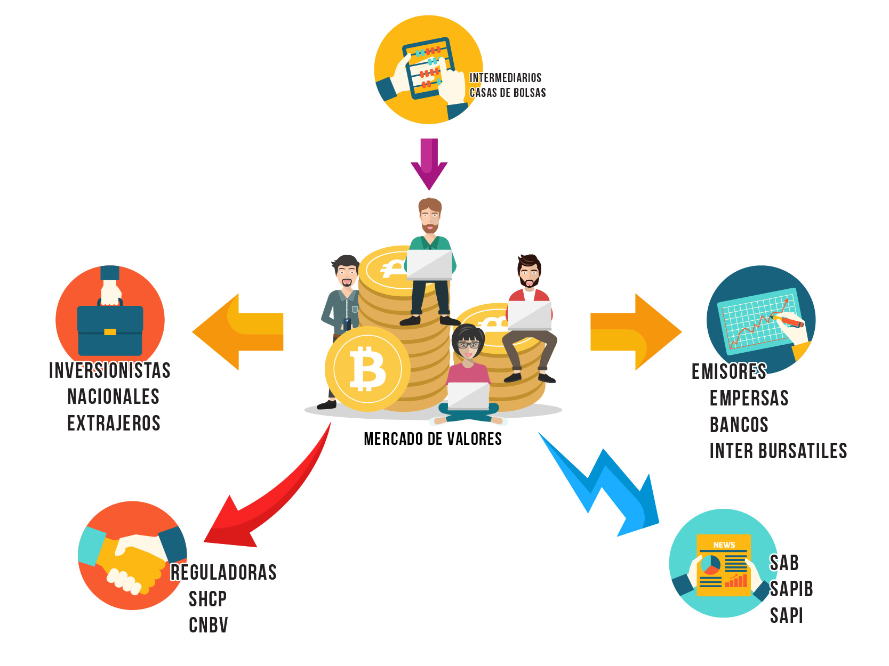

# ENTORNO ECONÓMICO DE MÉXICO

> **MAESTRÍA EN ADMINISTRACIÓN DE NEGOCIOS**
> Expediente: **00056957**
> Alumno: **Aldrin Gonzalez Cancino** - *sounix@gmail.com*
> 

## Sesión 4 - Act 1: Nueva Ley del Mercado de Valores

### Funcionamiento del Mercado de Valores

### Código de Mejores Prácticas BANORTE SAB de CV

Mencionando aspectos muy importantes que siguen el **Código de Mejores Prácticas** se busca saber que grado de implementación de estas recomendaciones han sido aplicadas por dichas instituciones, igual forma se busca con el cuestionario que los resultados sean fáciles de interpretar y analizar.

Este Código de Mejores Prácticas busca que todas las instituciones adapten esto como los principios generales de un *Gobierno Corporativo*.

El Cuestionario contiene Preguntas sobre los siguientes temas:

- Asamblea de Accionistas
- Consejo de Administración
- Función de Auditoria
- Función de Evaluación y Compensación
- Función de Finanzas y Planeación

Uno de los aspectos mas importante con el llenado del cuestionario es que al poner una respuesta, esta sea clara y precisa (positiva o negativa) y en el caso que sea negativa se anote en los comentarios por que no se cumple las recomendación de las mejores practicas, y si se tiene algún procedimiento alterno para cumplir esta misma.

### Bibliografía/Cibergrafía

- **GRUPO FINANCIERO BANORTE SAB DE CV.** - *Cuestionario Para Evaluar el Grado de Adhesión al Código de Mejores Prácticas Corporativas por Parte de Las Sociedades Emisoras.* Consultado el 02 de Octubre de 2018: [1_CMPC_GFNorte_2017.pdf](https://www.banorte.com/cms/archivos/1_CMPC_GFNorte_2017.pdf)
